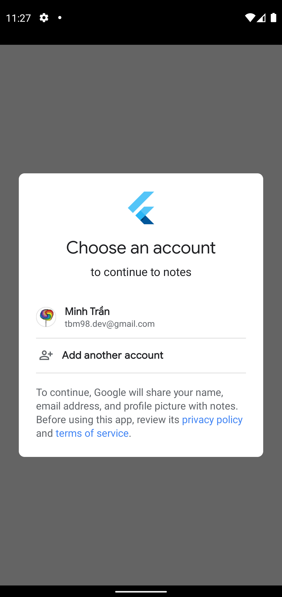
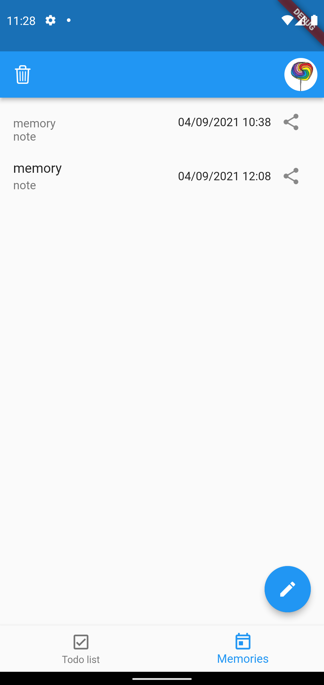
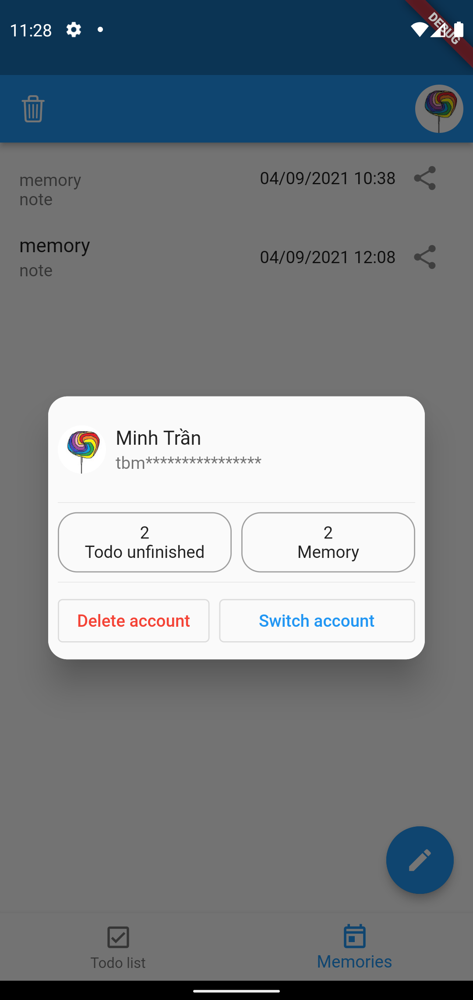
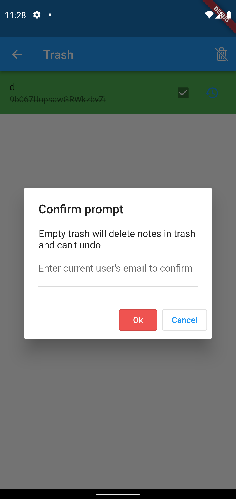

# Notes 

My notes, todo list, and memories.

| Android      | iOS | macOS | web |
| ----------- | ----------- | ----------- | ----------- |
| x      | x       |        |         |

Guest             |  Login                                  | Memories
:-------------------------:|:-------------------------:|:-------------------------:
  |   | 
Share memory             |  info                                  | Confirm empty trash
  |   | 

# How to run?

Follow [FlutterFire Overview](https://firebase.flutter.dev/docs/overview) to learn how to setup firebase.

